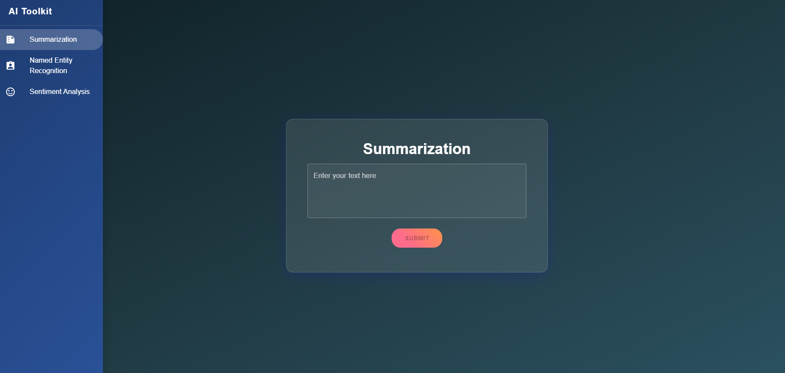
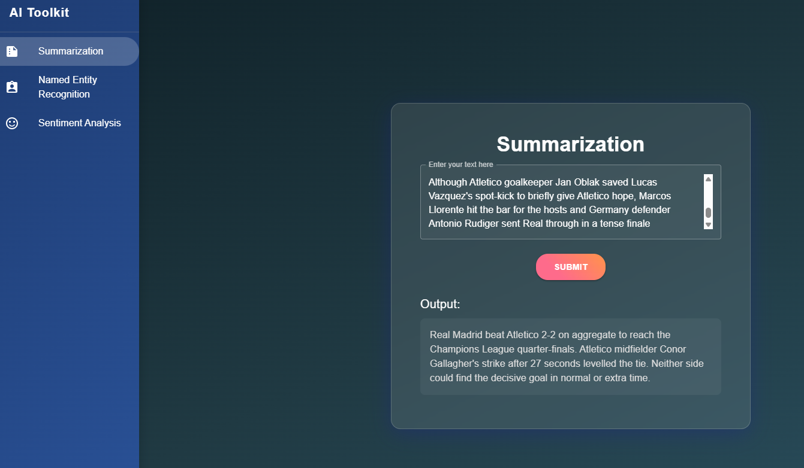
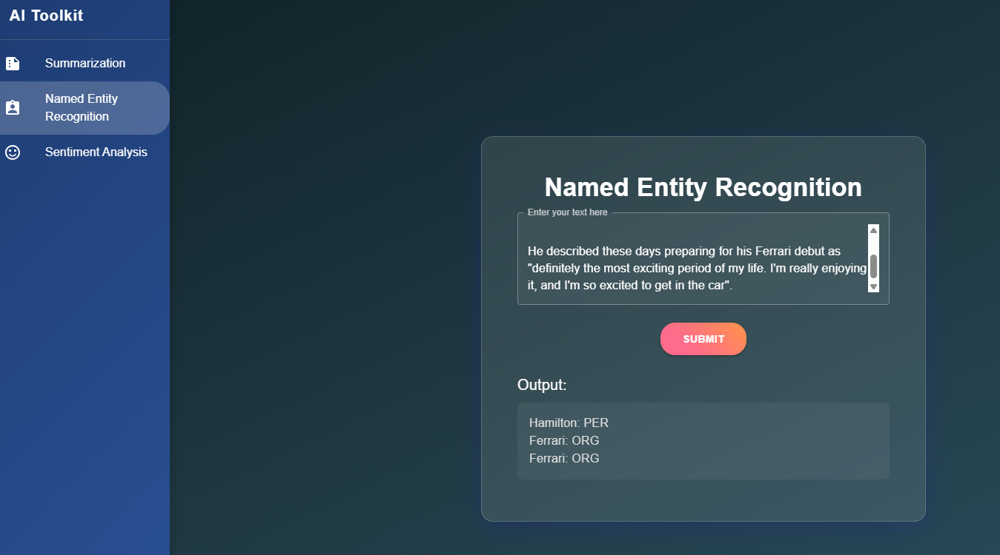
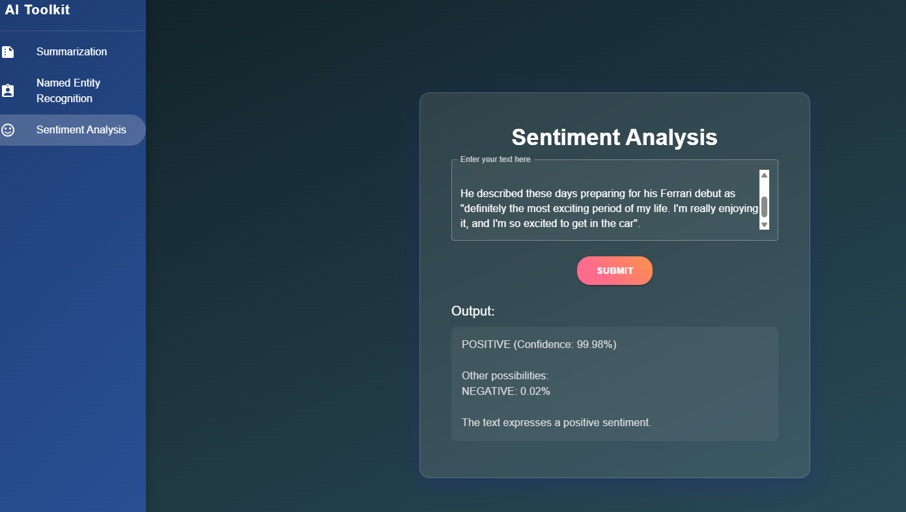
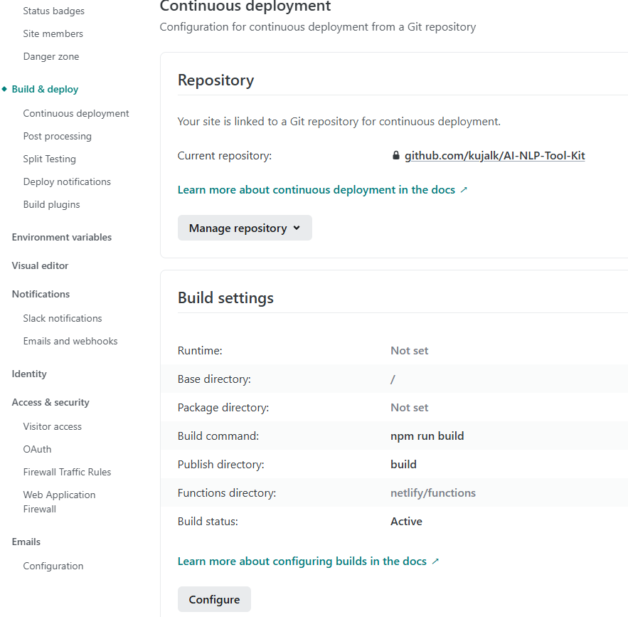
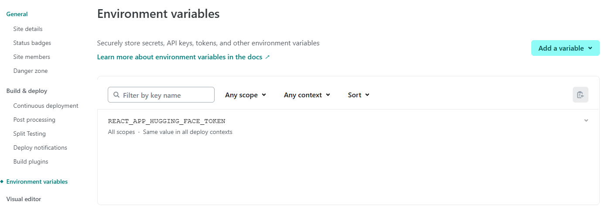

# 🧠 AI NLP Toolkit



## ✨ Overview

AI NLP Toolkit is a sleek, modern React application that harnesses the power of Hugging Face's state-of-the-art AI models to perform various natural language processing tasks. With an elegant glass-morphism UI and smooth animations, this app provides an intuitive interface for text analysis.

## 🚀 Features

- **Text Summarization**: Condense long articles into concise summaries
- **Named Entity Recognition (NER)**: Identify and classify entities in text
- **Sentiment Analysis**: Determine the emotional tone of text

## 🖼️ Screenshots

<div align="center">
  
  
  <p><em>Summarization in action</em></p>

  
  <p><em>Named Entity Recognition</em></p>

  
  <p><em>Summarization in action</em></p>
</div>

## 🛠️ Technologies

- **React**: UI component library
- **Material UI**: Styling and components
- **Hugging Face API**: AI models

## 🔧 Installation

1. **Clone the repository**
   ```bash
   git clone https://github.com/yourusername/ai-toolkit.git
   cd ai-toolkit
   ```

2. **Install dependencies**
   ```bash
   npm install
   ```

3. **Environment Setup**
   - Create a `.env` file in the root directory
   - Add your Hugging Face API token:
     ```
     REACT_APP_HUGGING_FACE_TOKEN=your_hugging_face_token_here
     ```
   - You can get a token from [Hugging Face](https://huggingface.co/settings/tokens)

4. **Start the development server**
   ```bash
   npm start
   ```

## 🔒 Environment Variables

This project uses environment variables to securely store API keys:

| Variable | Description |
|----------|-------------|
| `REACT_APP_HUGGING_FACE_TOKEN` | Your Hugging Face API token |

## 💡 Usage

1. Select a task from the sidebar (Summarization, NER, or Sentiment Analysis)
2. Enter or paste your text into the input field
3. Click "Submit"
4. View your results in the output area

## ⚙️ Models Used

- **Summarization**: facebook/bart-large-cnn
- **Named Entity Recognition**: dslim/bert-base-NER
- **Sentiment Analysis**: distilbert-base-uncased-finetuned-sst-2-english


## 🚀 Deployment in Netlify

1. Connect your Gitrepo from Netlify
2. Insert correct build params

3. Create the env

4. Deploy the app

## 🤝 Contributing

Contributions are welcome! Please feel free to submit a Pull Request.

1. Fork the repository
2. Create your feature branch (`git checkout -b feature/amazing-feature`)
3. Commit your changes (`git commit -m 'Add some amazing feature'`)
4. Push to the branch (`git push origin feature/amazing-feature`)
5. Open a Pull Request

## 📝 License

This project is licensed under the MIT License - see the [LICENSE](LICENSE) file for details.

## 🙏 Acknowledgements

- [Hugging Face](https://huggingface.co/) for their AI models
- [Material UI](https://mui.com/) for the component library

---

<div align="center">
  <p>Made with ❤️ by K.Janarthanan</p>
  <p>⭐ Star this repository if you found it useful! ⭐</p>
</div>